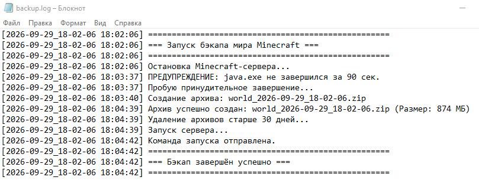
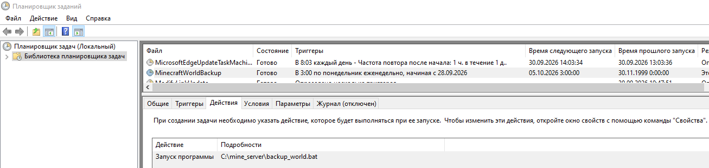
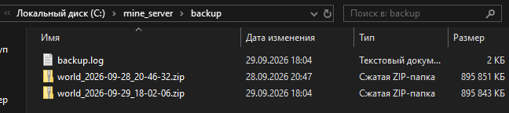

# MinecraftBackup

Bash/bat-скрипт для автоматического еженедельного бэкапа мира Minecraft-сервера под Windows.
Останавливает сервер, упаковывает папку `world` в ZIP-архив, удаляет архивы старше 30 дней,
логирует всё в файл и запускает сервер обратно.

## Что делает скрипт

1. Проверяет, что папка `C:\mine_server\world` существует.
2. Останавливает Minecraft-сервер (мягко, через `taskkill` без `/F`; при превышении
   таймаута — принудительно).
3. Дожидается завершения процесса `java.exe`.
4. Создаёт ZIP-архив папки `world` через PowerShell `Compress-Archive`.
5. Записывает в лог имя, размер архива и статус операции.
6. Удаляет архивы старше `RETENTION_DAYS` дней (по умолчанию 30).
7. Запускает сервер обратно через `start_server.bat`.
8. Пишет лог в `C:\mine_server\backup\backup.log` (UTF-8).

## Содержимое репозитория

```
MinecraftBackup/
├── backup_world.bat      # основной скрипт бэкапа
├── start_server.bat      # запуск сервера с заголовком окна
├── README.md             # этот файл
├── .gitignore
└── screenshots/
    ├── 01-task-scheduler.png
    ├── 02-backup-log.png
    └── 03-backup-folder.png
```

## Требования

- **Windows 10 / 11** (или Windows Server 2016+).
- **PowerShell 5.1+** — идёт в комплекте с Windows.
- **Права администратора** — нужны для `taskkill` и записи в `C:\mine_server`.
- Свободное место на диске **≥ 2× размера папки `world`** (для архива + временных файлов).
- Minecraft-сервер (vanilla / Paper / Spigot / Purpur — не важно), запущенный
  через `start_server.bat`.

## Настройка

Откройте `backup_world.bat` в блокноте и при необходимости поменяйте блок в начале файла:

```bat
set "SERVER_DIR=C:\mine_server"
set "WORLD_DIR=%SERVER_DIR%\world"
set "BACKUP_DIR=%SERVER_DIR%\backup"
set "LOG_FILE=%BACKUP_DIR%\backup.log"
set "RETENTION_DAYS=30"
set "SERVER_TITLE=Minecraft Server"
set "START_SERVER_BAT=%SERVER_DIR%\start_server.bat"
set "WAIT_JAVA_MAX=90"
```

| Переменная          | Что означает                                                        |
|---------------------|---------------------------------------------------------------------|
| `SERVER_DIR`        | Корневая папка сервера                                              |
| `WORLD_DIR`         | Папка мира, которую архивируем                                      |
| `BACKUP_DIR`        | Куда складывать архивы                                              |
| `LOG_FILE`          | Файл лога                                                           |
| `RETENTION_DAYS`    | Сколько дней хранить архивы                                         |
| `SERVER_TITLE`      | Заголовок окна сервера (устанавливается в `start_server.bat`)       |
| `START_SERVER_BAT`  | Путь к bat-файлу запуска сервера                                    |
| `WAIT_JAVA_MAX`     | Сколько секунд ждать завершения `java.exe` (по умолчанию 90)        |

### `start_server.bat` — важный момент

Внутри **обязательно** должна быть строка `title Minecraft Server` — иначе
`backup_world.bat` не найдёт окно сервера и не сможет его остановить.

```bat
@echo off
chcp 65001 >nul
title Minecraft Server
cd /d C:\mine_server
"C:\Users\super\.jdks\openjdk-25.0.2\bin\java.exe" -Xmx4G -Xms2G -jar server.jar nogui
pause
```

## Как запустить

### Вручную (для теста)

Откройте `cmd` **от имени администратора**:

```cmd
C:\mine_server\backup_world.bat
```

Что должно произойти:

- сервер закроется,
- в `C:\mine_server\backup\` появится `world_ГГГГ-ММ-ДД_ЧЧ-ММ-СС.zip`,
- сервер запустится обратно,
- в `backup.log` появится полный отчёт.

### Автоматически по расписанию (Планировщик задач)

1. Win + R → `taskschd.msc` → Enter.
2. Справа «Создать задачу» (не «Простую задачу»).
3. Вкладка **Общие**:
   - Имя: `MinecraftWorldBackup`
   - Галка «Выполнять с наивысшими правами».
4. Вкладка **Триггеры** → Создать:
   - «По расписанию», еженедельно, понедельник, 03:00.
5. Вкладка **Действия** → Создать:
   - Программа: `C:\mine_server\backup_world.bat`
   - Рабочая папка: `C:\mine_server`
6. ОК → ввести пароль учётной записи.

**Или одной командой** (cmd от админа):

```cmd
schtasks /create /tn "MinecraftWorldBackup" ^
  /tr "C:\mine_server\backup_world.bat" ^
  /sc weekly /d MON /st 03:00 /rl highest
```

## Пример лога



```
[2026-09-29_18-02-06 18:02:06] ===================================================
[2026-09-29_18-02-06 18:02:06] === Запуск бэкапа мира Minecraft ===
[2026-09-29_18-02-06 18:02:06] ===================================================
[2026-09-29_18-02-06 18:02:06] Остановка Minecraft-сервера...
[2026-09-29_18-02-06 18:03:37] ПРЕДУПРЕЖДЕНИЕ: java.exe не завершился за 90 сек.
[2026-09-29_18-02-06 18:03:37] Пробую принудительное завершение...
[2026-09-29_18-02-06 18:03:40] Создание архива: world_2026-09-29_18-02-06.zip
[2026-09-29_18-02-06 18:04:39] Архив успешно создан: world_2026-09-29_18-02-06.zip (Размер: 874 МБ)
[2026-09-29_18-02-06 18:04:39] Удаление архивов старше 30 дней...
[2026-09-29_18-02-06 18:04:39] Запуск сервера...
[2026-09-29_18-02-06 18:04:42] Команда запуска отправлена.
[2026-09-29_18-02-06 18:04:42] ===================================================
[2026-09-29_18-02-06 18:04:42] === Бэкап завершён успешно ===
[2026-09-29_18-02-06 18:04:42] ===================================================
```

## Скриншоты

**Планировщик задач:**



**Папка с архивами:**



## Известные ограничения

- **Сервер на время бэкапа выключается.** Игроки отключаются.
- В текущей версии остановка делается через `taskkill` (без `/F` — мягко,
  с fallback на `/F` — принудительно). Мягкая остановка не всегда срабатывает,
  если окно сервера принадлежит `WindowsTerminal.exe`, а не `cmd.exe`.
- Если `taskkill` не смог мягко закрыть сервер за `WAIT_JAVA_MAX` секунд —
  процесс убивается принудительно, и мир может быть сохранён не до конца.
  Архив в этом случае может содержать данные «на момент последнего автосейва».

**Более надёжный вариант** — управление сервером через RCON (`save-off`,
`save-all`, `save-on`) без остановки процесса. Это позволяет бэкапить мир
без перезапуска сервера и без вылета игроков.

## Лицензия

MIT — делайте что хотите.